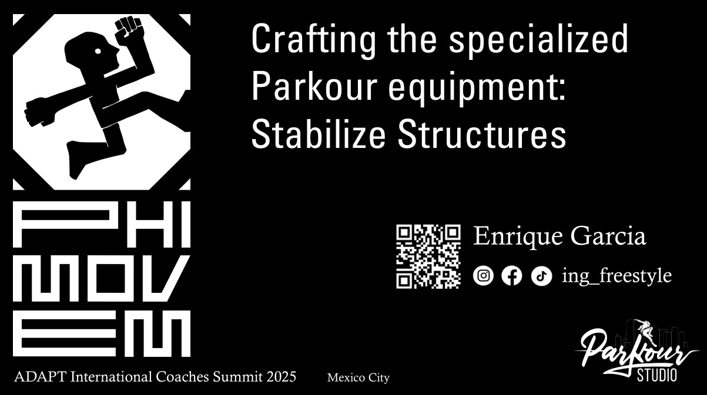
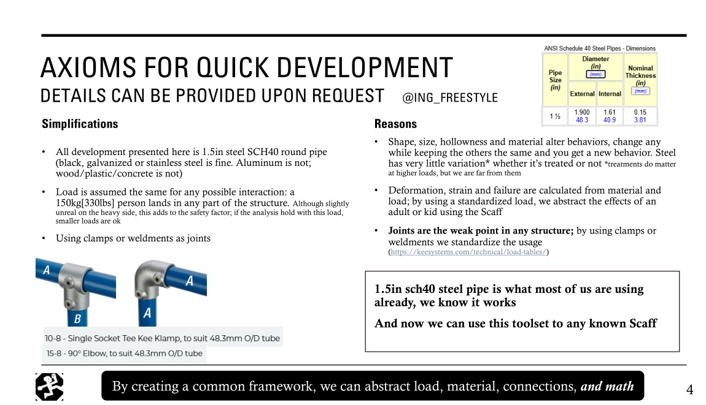

# Presentation for the ADAPT Summit 2025 [Slides here](StabilizeScaff_handouts.pdf)
Your gym must be a better alternative to a park, or you end up taking your coaching and classes at the park. On the same idea, we use this to create better parks.
We can only design and build within our knowledge. This makes design knowledge essential for financial sustainability. What you cannot do yourself, you pay someone to do.

If we are to make a living out of parkour, we need cash to grow and stay within our industry, otherwise, knowledge and money move out of the parkour industry.
By creating a common framework, we can abstract load, material, connections, and math

## Stabilize  steps:
1. Start from a picture or diagram of your shaky scaff
2. Draft all load planes, draw the expected load direction
3. If no coincident plane exists, create one as coincident as possible
4. Evaluate the load
5. If load is contained: End
6. If Load is not contained, go to 3

